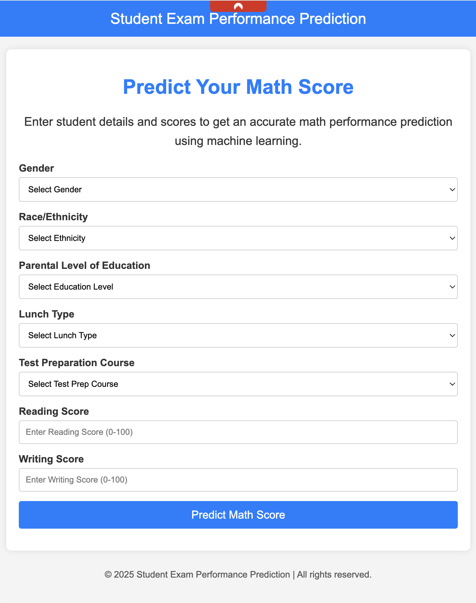
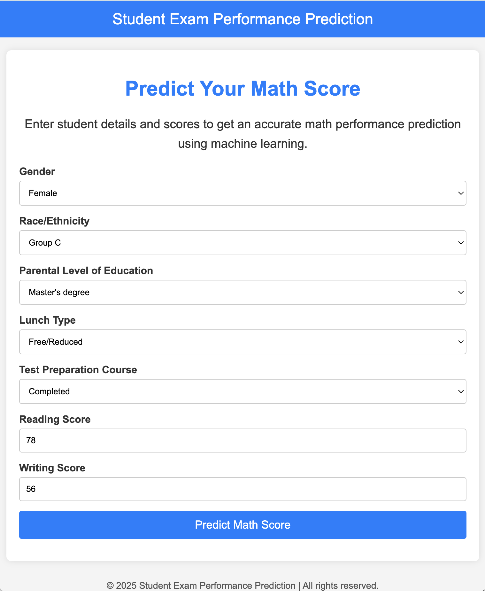
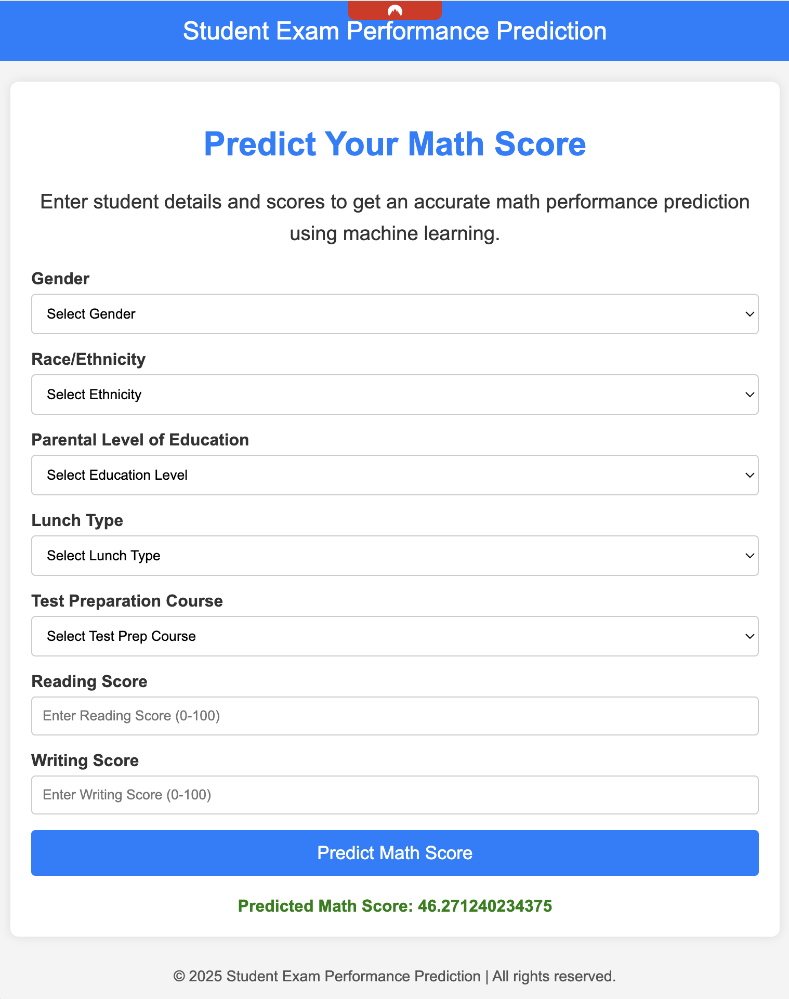
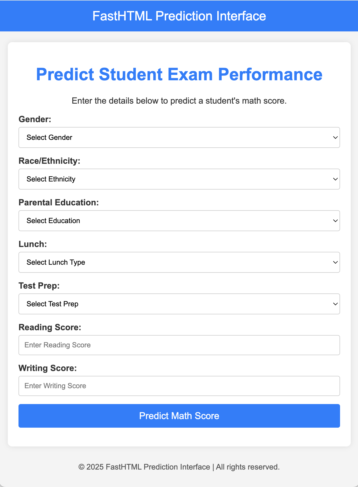
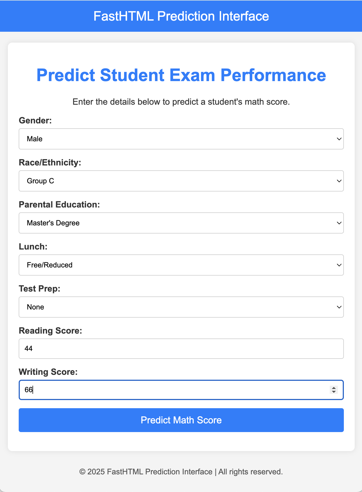
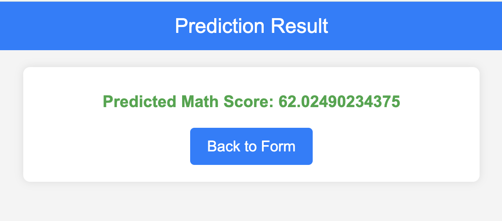

# Sample Apps Documentation

This document provides an overview of the prediction services implemented in this project. The system consists of multiple interfaces to handle predictions, including a **Flask web app**, a **FastAPI-based HTML interface**, and a **FastAPI REST API**.

## Table of Contents
- [Sample Apps Documentation](#sample-apps-documentation)
  - [Table of Contents](#table-of-contents)
  - [Overview](#overview)
  - [System Components](#system-components)
  - [Installation \& Setup](#installation--setup)
    - [1. Start the prediction services](#1-start-the-prediction-services)
  - [Usage](#usage)
    - [Flask Web App](#flask-web-app)
    - [FastAPI HTML Interface](#fastapi-html-interface)
    - [FastAPI REST API](#fastapi-rest-api)
      - [Example Request](#example-request)
      - [Example Response](#example-response)
  - [Screen Shots](#screen-shots)
    - [Flask Web App](#flask-web-app-1)
  - [](#)
    - [FastAPI HTML Interface](#fastapi-html-interface-1)
  - [Error Handling](#error-handling)

---

## Overview
The project includes three different approaches for serving predictions:

1. **Flask Web App (`predict_app.py`)**  
   - A traditional web interface where users enter input values via an HTML form.
   - Processes input, validates data, and returns predictions.

2. **FastAPI HTML Interface (`predict_fasthtml_app.py`)**  
   - A FastAPI-based frontend that interacts with a backend prediction API.
   - Uses Jinja2 templates for a responsive interface.

3. **FastAPI REST API (`predict_rest_api.py`)**  
   - A RESTful API that allows programmatic interaction with the model.
   - Accepts structured JSON requests and returns predictions in JSON format.

---

## System Components
| Service | Description | Endpoint |
|---------|------------|----------|
| Flask Web App | Traditional web form for making predictions | `/predictdata` |
| FastAPI HTML | FastAPI-based web UI for interactive predictions | `/submit` |
| FastAPI REST API | API endpoint for programmatic predictions | `/predict` |

---

## Installation & Setup
To set up and run the prediction services, follow these steps:

### 1. Start the prediction services
- **Flask Web App:**  
  ```bash
  python predict_app.py
  ```
  - Runs on `http://0.0.0.0:8097/`

- **FastAPI HTML App:**  
  ```bash
  uvicorn predict_fasthtml_app:app --host 0.0.0.0 --port 8009 --reload
  ```
  - Runs on `http://0.0.0.0:8009/`

- **FastAPI REST API:**  
  ```bash
  uvicorn predict_rest_api:app --host 0.0.0.0 --port 8008 --reload
  ```
  - Runs on `http://0.0.0.0:8008/`

---

## Usage

### Flask Web App
1. Navigate to `http://localhost:8097/`
2. Enter input data using the form.
3. Submit the form to get the prediction.
4. The predicted value will be displayed on the same page.

### FastAPI HTML Interface
1. Navigate to `http://localhost:8009/`
2. Fill in the form fields and submit.
3. The result will be displayed on a new page.

### FastAPI REST API
You can send JSON requests to the `/predict` endpoint.

#### Example Request
```bash
curl -X POST "http://localhost:8008/predict" \
-H "Content-Type: application/json" \
-d '{
    "payload": {
        "data": {
            "gender": "male",
            "race_ethnicity": "group A",
            "parental_level_of_education": "bachelor's degree",
            "lunch": "standard",
            "test_preparation_course": "none",
            "reading_score": 72.0,
            "writing_score": 74.0
        }
    }
}'
```

#### Example Response
```json
{
    "code": 0,
    "code_text": "ok",
    "message": "Processed successfully.",
    "data": {"math_score": 76.91}
}
```
---

## Screen Shots

### Flask Web App

.
.

---
### FastAPI HTML Interface
.



---

## Error Handling
| Error Type | Cause | Example |
|------------|-------|---------|
| **Validation Error** | Missing or incorrect data type | `400 Bad Request - Missing required field 'reading_score'` |
| **Internal Server Error** | Unexpected issue during processing | `500 Internal Server Error - Model not loaded` |
| **Connection Error** | API call failure | `Failed to connect to prediction service` |

